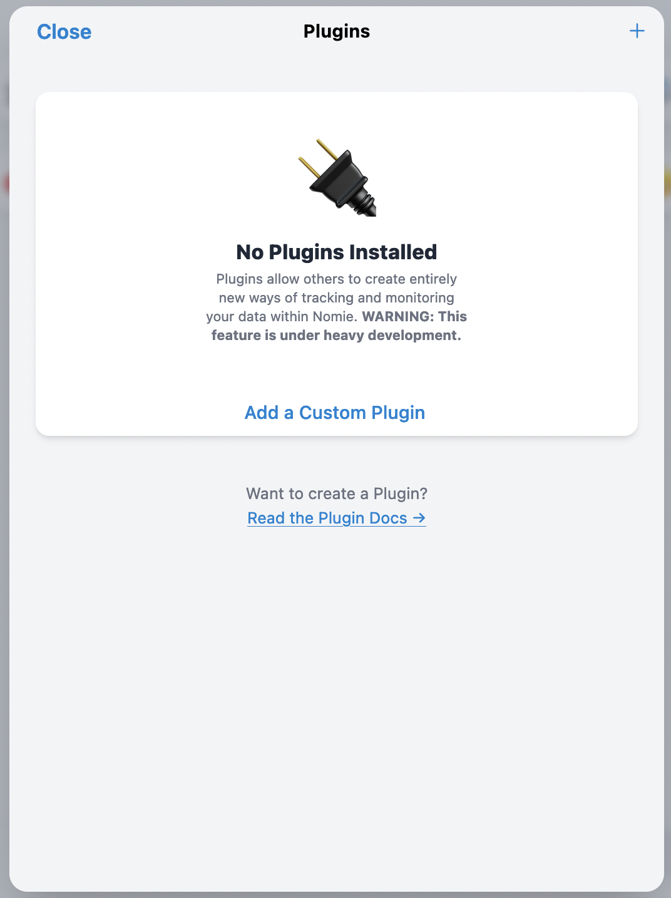

# ⌚️Nomie Apple Watch Plugin

The ⌚️Nomie Apple Watch Plugin is a plugin for Nomie6-oss.

## About the ⌚️Nomie Apple Watch Plugin

The Nomie Apple Watch Plugin enables you to sync data with the Nomie Apple Watch app.
The plugin will sync a (by the user) choosen subset of Trackables with the Apple Watch App so that you can track directly from your Apple Watch.
The Apple Watch App will use these synced Trackables to let you track directly to Nomie via the (seperate) 🪝Nomie API Plugin.

## Installing the Plugin

The url of the plugin is:

[https://dailynomie.github.io/nomie-plugin-applewatch/](https://dailynomie.github.io/nomie-plugin-applewatch/)

The ⌚️Nomie 7 Apple Watch Plugin can be installed in Nomie via the following steps:

* Go to the More Tab
* Select Plugins
* Click the + or Add Custom Plugin
* Provide the url for the plugin
* Tap Install Plugin



## Setting Up the Plugin

The initial setup of the plugin is more complex then with the other plugins as it requires the setup of the gollowing components:

* The ⌚️Nomie Apple Watch Plugin. (of course....)
* The Apple Watch Api Server => to sync your Trackables you want to use with the Apple Watch App to.
* The Nomie Apple Watch App => the app to enable you to log Trackables and other info on your Apple Watch.
* The Nomie API Server => to receive logs from your Apple Watch
* The 🪝Nomie API Plugin => sync with the API server and save logs to Nomie

In general, the setup looks as shown below. I will explain in some more details in the paragraphs to follow.


### The Apple Watch API Server

The Apple Watch API server will hold the details which you would like to sync with the Apple Watch. These details consist of:

* The Trackables you would like to sync
* The details about the Nomie API Server so that the Apple Watch knows where to send the logs to, using the correct API key.

#### Installing the Apple Watch API server

My instantiation of the server is build with Node Red and can be deployed in many ways. You can find the source code at:

[https://github.com/RdeLange/nomie-server-awapi](https://github.com/RdeLange/nomie-server-awapi)

The most easy way of deploying the server is via a docker container. It can -for instance- be hosted on your Synology Nas.

The Docker image is available at:[https://hub.docker.com/repository/docker/rdelange/dailynomie-awapiserver/](https://hub.docker.com/repository/docker/rdelange/dailynomie-awapiserver/)

An example of deployment stack is as follows:

```javascript
version: '3'
services:
 nomieawapiserver:
  image: rdelange/dailynomie-awapiserver:latest
  container_name: dailynomie-awapiserver-docker
  volumes:
   - /volume1/docker/nomieawapiserver:/home
  ports:
      - "1441:1880"

```

where the volumes line points to a directory on your server to persist data.

More installation instructions can be found following above link to the Nomie Apple Watch API Server GitHub page.

#### Using the Server

You can reach the server GUI by using your domain, followed by /ui (example: https://awapi.mydomain.com/ui)

You will be provided with the following screen:


As you might notice, it looks similar to the Nomie Api Server, but this server is using a purple theme so you can easy see the difference. The default login codes are given in above introduction screen, please change them immediately to prevent easy login by others.....

#### Change your credentials

You can chage your credentials by logging in with the default credentials via the Log In option at the menu at the left top corner:


Once you have changed your credentials and logged on again with your new password, you can enter the server dashboard by choosing the API Management option in the menu.

#### The API Server Dashboard

The API server dashboard consists of 3 sections:

* Managing the registered keys
* Managing the info about the Nomie API
* Managing the choosen Trackables Syncs


For all sections you have the option to create the backend database table. When everything is running fine you should not have to use this option as the databases are automatically setup when the server is deployed.

You can remove individual keys or flush all keys which are not used for longer then a month.

For the Nomie API info and Trackables Syncs you have the option to flush them all or only the entries older then a Month.

In the future I might add some additional management options, but as the server is intended to be self hosted for you / your family / your friends, these simple options should be enough.

#### Managing accounts

If you want to co-manage the server with somebody else, you have the option to give other users access to the server. You can do this via the account section in the menu.

Please be aware that this is a very simple implementation of account management. It works, but as this server is intended to be privately hosted with limitted usage and workload it is not likely that this section will be further developped in the future.

#### Why Node-Red

I mentioned above that this server is build using Node-Red. I am fully aware that there are much better ways of implementing the same functionality, but I like to experiment and learn...and this was one of these journies.

### The Apple Watch App

More information on the usage of the Apple Watch App can be found at:

-TO BE INCLUDED-

### The Nomie API Server

The Nomie API Server is the server which enables tou to send logs to. The 🪝Nomie API Plugin will sync with this sever and save the logs in Nomie.

More information on the Nomie APi Server can be found at:
[https://github.com/RdeLange/nomie-server-api](https://github.com/RdeLange/nomie-server-api)

### The 🪝Nomie API Plugin

The Nomie API Plugin will pull the logs from above mentioned server and save them to Nomie.
This Plugin should be enabled alongside the ⌚️Nomie Apple Watch Plugin.
More information can be found at:
[https://github.com/RdeLange/nomie-plugin-api](https://github.com/RdeLange/nomie-plugin-api)

## Using the ⌚️Nomie Apple Watch Plugin

After installing the plugin, please start the plugin and you will see the following screen:


First make sure to define your sync settings via the settings menu.

### The Settings Menu

Enter the settings menu by clicking on the settings button at the top menu of the screen:


You will be directed to the following screen:


Here you can configure the following items:

**Nomie API:**

* These are the configuration settings as configured in the 🪝Nomie API Plugin. You can find them in the settings area of this plugin.

**Nomie Apple Watch API:**

* These are the configuration settings as configured in the Apple Watch App.
* As you are not able to copy content from the Apple Watch, the best way to get the key to the plugin is by using the extended keyboard on your Iphone when using the Apple Watch. You can copy the key via this extended keyboard. More information on how to achieve that can be found in the Apple Watch App documentation

**Sync at Nomie Start:**

* This option will enable to sync the Trackables as per your latest sync settings each time Nomie is starting.

Once you have configured the settings you can save them and return to the main screen.

### The main screen

After your initial setup, the main screen will enable you to select the Trackables you want to make available in the Nomie Apple Watch App.

First of all you can select the Trackables used for the last x days. In below example I used the last 10 days:


As you can see, this Last 10 Days selection is selecting 9 Trackables. 

When you do not want to sync certain Trackables with the Apple Watch app, even if they appear in the selection on the left of the screen, you can add them on the blacklist at the right bottom of the screen.

When you want to add more Trackables then selected (for example a Trackable only used 15 Days ago), you can add these in the Custom selection at the right top of the screen.

In below example I added the Hyperactivity Trackable while I blaclisted the Workout Trackable.

The next time the Plugin will sync with the Nomie Apple Watch API Server, all the Trackables on the left, including Hyperactivity and excluding Workout will be synced.


I guess this is all for this plugin.

As always, please enjoy and have fun with it!
